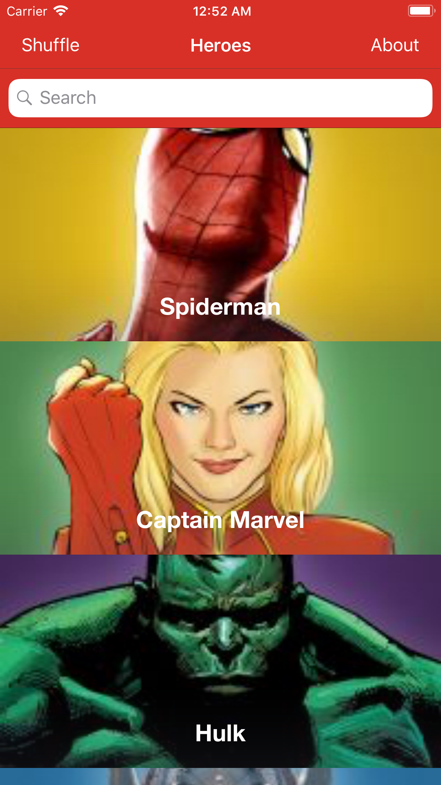
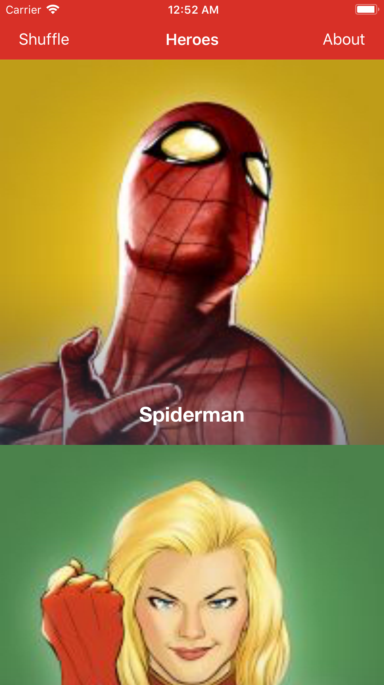
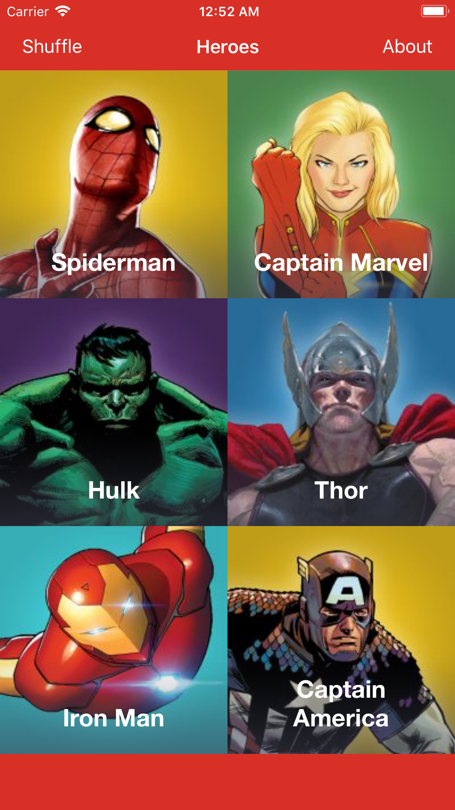
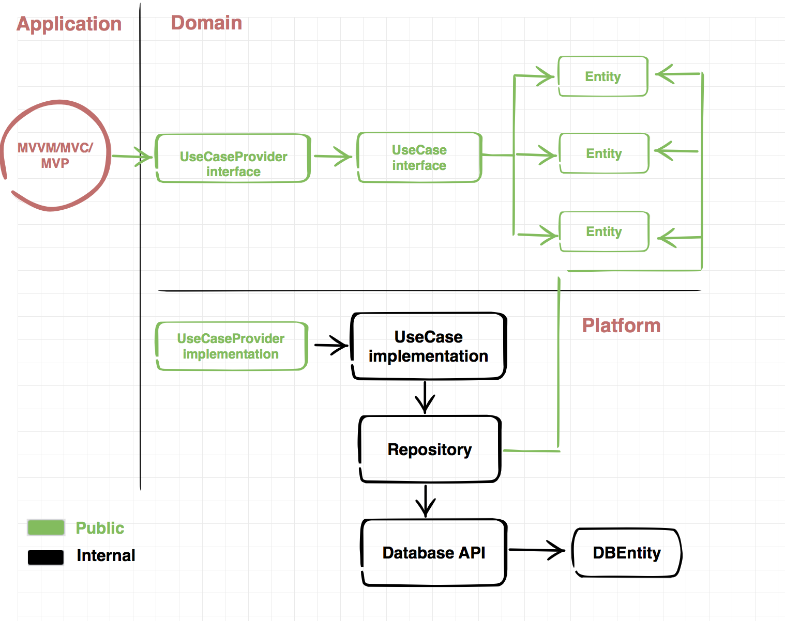

Marvel Heroes
============

This project has been developed for my personal portfolio to show the way I write/organize code with Swift4.

What does it do?

Fetches a list of superheroes, shows them in a pretty way with master-detail pattern.

## App Overview

### UITableView

### UICollectionView

### UICollectionView (2)

### Details

## Features included

### Git

Using Gitflow:

* Master (Releases here)
* Hotfixes (Production fixes that don't get to mix with current development)
* Dev (Current version)
* For each feature, a branch is created from Dev and then merged into it.

Using .gitignore for Swift & Xcode

### Code Style
Swiftlint configuration file is contained inside App > Code > Project > .swiftlint.yml (hidden file!)
Script to unify style included in App > SyntaxScripts > ./styleMe.py

### Architecture
Using Clean architecture - Model+View+Presenter+Navigator for a simple case,
I'm accessing directly the view from the presenter to make things easier, but in theory, everything should communicate with protocols (interfaces)

I've also worked with:

* VIPER
* Massive View Controller (Apple)
* Model View ViewModel + Rx
* Redux / Flux (Facebook)

### Reactive
Using RxSwift for operations and UI as it's really nice to use, compose, filter, transform, ...

## Translations
Using Localized strings for English and Spanish

### Log system
Using different log level, and never in production

### Frameworks
All is split into a clean architecture with frameworks for:
* Project (Views, UIClasses, etc.)
* Domain (Models, classes, use cases and providers)
* NetworkKit (Reusable for every project and serializable)
* Network Specific (Using Alamofire, which is good for everything)
* PlatformNetworkStatic ~> Implementation for Use Cases which are NOT connecting to anything (mocks if you like)
* PlatformNetworkApi ~> Implementation for Use Cases which are connecting to the API with different environments

Trying to take dependencies to the minimum (UIKit or external)

### Classes

#### Application
* Dependencies and frameworks initialization

#### Common
* Constants: Defined for the project (if needed)
* Theme Color: Holds the color palette
* UIClasse: Definition of specific components for the project

#### View Controllers / Modules
* Scenes

### Dependencies
I usually use CocoaPods although I know how to work with Carthage.

### Code Autogeneration
Using Sourcery to auto generate code like:
* Hashable methods
* Equal
* Enum utilities
* ...

## Improvements

### Features
* Favorites
* Caché

### Fastlane
* Automate Certificate generation / sharing
* Automate Provisioning profile generation / sharing
* Automate screenshots in different languages
* Automate metadata upload to the App Store
* Automate Binary upload to the App Store

### Jenkins
* Integrate fastlane in Jenkins.
* Run tests before building
* Use the latest stable status from development into a nightly build.
* Release to the store with one click.

### Analytics
* Integrate Google Analytics

### Crash system
* Integrate a crash system (Fabric + Crashlytics)

### Push notifications
* Include mock notifications (simulator remote notifications)
* Include real notifications

### Unit Testing
* TDD
* Helps writing pure methods / specification

### About me

If you have any question, comment, want to fork this project, ... you can do pretty much anything with it. If you use my personal Helpers/Categories/Models I'll be glad if you just wrote a mention in your project, send me an email or buy me a beer (that would do it :P).

Vicente Crespo Penadés

[LinkedIn] - My LinkedIn profile

[Email] - Send me an email

License
----

MIT

## License
Created by Vicente Crespo Penadés - vicente.crespo.penades@gmail.com
Copyright (c) 2017 Vicente Crespo  All rights reserved.
All images and content are copyrighted to Marvel Entertainment

[LinkedIn]:https://www.linkedin.com/in/vicente-crespo-penad%C3%A9s-a49a4942/
[Email]:mailto:vicente.crespo.penades@gmail.com

